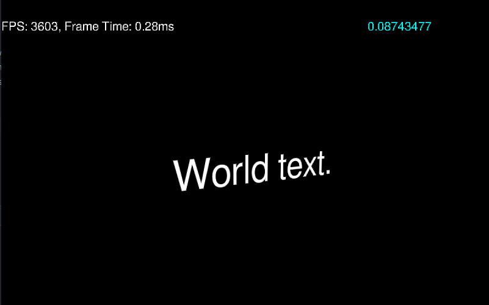

# TextRendering
This is a c++ program to experiment with rendering texts using my custom Rendering Engine SpeltEngine.

This project was meant as a basis to add text rendering built into the SpeltEngine.

## Features

* MSDF text rendering
* UI text
* World text

### MSDF text rendering

To get the Multi-channel Signed Distance Field atls this program uses a tool called [msdf-atlas-gen](https://github.com/Chlumsky/msdf-atlas-gen) made by Chlumsky. This also generates a metadata json file that contains pixel locations for each glyph. 

With the generated data we can generate a mesh with the correct UV coordinates for the required characters. We use these UV coordinates to sample the MSDF atlas.

For each pixel we get the median of all 3 color channels. This medain represents the unsigned distance from the edge of of the glyph to that pixel. We convert this to a signed value and use the metadata to convert it into the real pixel distance.

This distance is then used to decide where to color the pixel white and where to not color it at all. The shader uses smoothstep to have a smooth edge instead of a hard cutoff.

### UI and World text

The program uses 2 different renderpasses to achieve both World space and UI space text. Because rendering of the text is done in the fragment shader There is no difference in rendering for both passes.

## Screenshots

